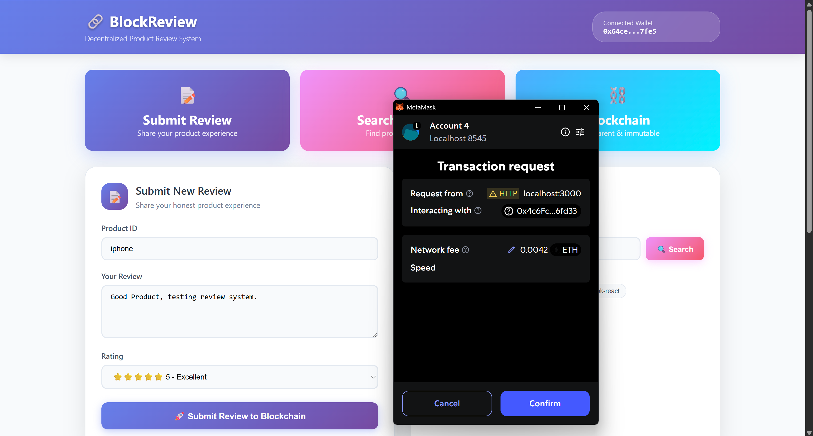
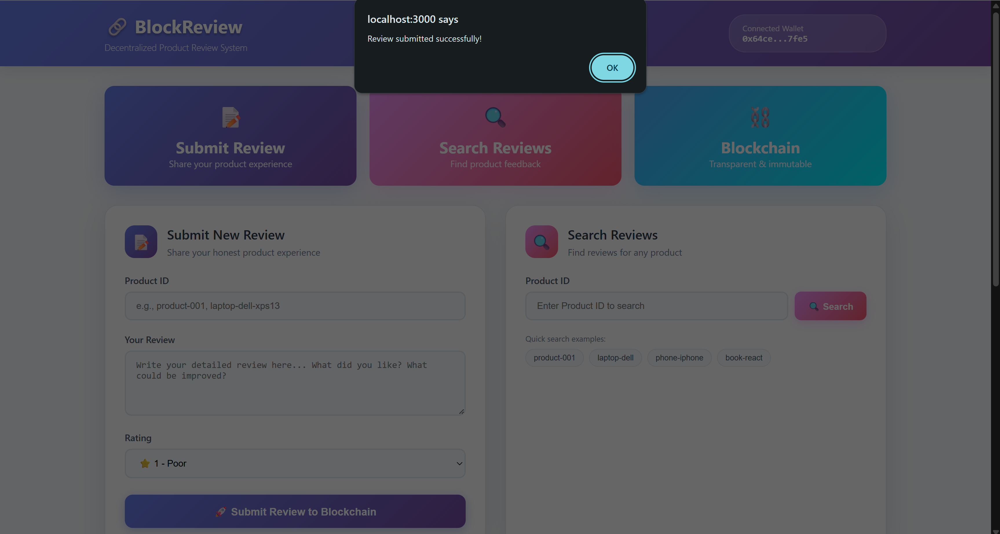
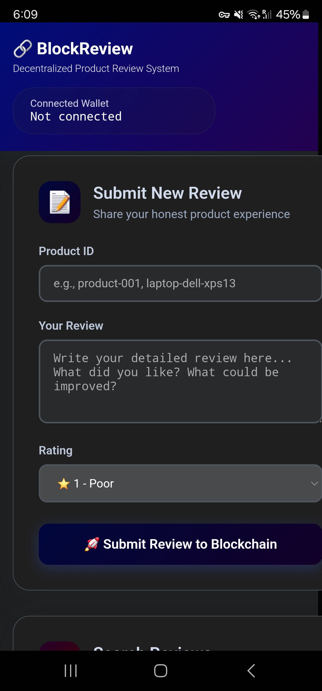

# BlockReview - Decentralized Product Review System

**Student:** Asma  
**Registration No:** 21PWBCS0870  
**Semester:** 8th (Final)  
**Course:** Blockchain Technology

## Abstract

This project presents a decentralized product review system built on Ethereum blockchain technology. The system allows users to submit transparent, immutable product reviews that cannot be tampered with or deleted. Using Solidity smart contracts and React.js frontend, the application ensures review authenticity through blockchain verification while preventing duplicate reviews from the same user. The system addresses trust issues in traditional centralized review platforms by leveraging blockchain's immutable nature.

## Introduction

BlockReview is a decentralized application (DApp) that revolutionizes product reviews by storing them on the Ethereum blockchain. Unlike traditional review systems where companies can manipulate or delete reviews, this blockchain-based approach ensures complete transparency and immutability. Users connect their MetaMask wallets to submit verified reviews that are permanently recorded on the blockchain.

## Motivation

Traditional product review systems suffer from several critical issues:

- **Lack of Trust**: Companies can delete negative reviews or create fake positive ones
- **Data Manipulation**: Centralized systems allow review tampering
- **No Verification**: Difficult to verify if reviewers actually used the product
- **Censorship**: Reviews can be removed without user consent

Blockchain technology solves these problems by providing:

- **Immutability**: Reviews cannot be changed once submitted
- **Transparency**: All transactions are publicly verifiable
- **Decentralization**: No single entity controls the review data
- **User Authentication**: Wallet addresses provide verified identity

## Problem Statement

The current product review ecosystem lacks transparency and trust. Consumers rely on reviews to make purchasing decisions, but these reviews can be manipulated by companies or fake review farms. There is a need for a trustworthy, transparent review system where:

1. Reviews cannot be deleted or modified
2. Users are verified and cannot submit duplicate reviews
3. All review data is publicly accessible and verifiable
4. The system operates without central authority control

## Methodology

### System Architecture

The BlockReview system consists of three main components:

1. **Smart Contract Layer** (Solidity)
2. **Frontend Application** (React.js)
3. **Blockchain Integration** (MetaMask + Ethers.js)

### Features

#### Core Functionality

- **Review Submission**: Users can submit product reviews with ratings (1-5 stars) and comments
- **Duplicate Prevention**: Smart contract ensures one review per user per product
- **Review Retrieval**: Search and display all reviews for any product
- **Average Rating Calculation**: Automatic calculation of average ratings
- **Wallet Integration**: MetaMask authentication for user verification

#### Technical Features

- **Immutable Storage**: All reviews stored permanently on blockchain
- **Gas Optimization**: Efficient smart contract design to minimize transaction costs
- **Real-time Updates**: Live transaction status and confirmation feedback
- **Responsive Design**: Works seamlessly on desktop and mobile devices
- **Error Handling**: Comprehensive validation and error messages

### Smart Contract Details

The `ReviewSystem.sol` contract implements the following key functions:

```solidity
struct Review {
    address reviewer;
    string comment;
    uint8 rating;
    uint timestamp;
}

function submitReview(string memory productId, string memory comment, uint8 rating)
function getReviews(string memory productId) 
function getAverageRating(string memory productId)
function hasReviewed(address user, string memory productId)
```

#### Security Features

- **Input Validation**: Rating must be between 1-5 stars
- **Duplicate Protection**: Users cannot review the same product twice
- **Address Verification**: Only wallet owners can submit reviews
- **Timestamp Recording**: Each review includes blockchain timestamp

### Frontend Implementation

The React.js frontend provides:

- **Modern UI**: Clean, professional interface with gradient styling
- **MetaMask Integration**: Seamless wallet connection and transaction handling
- **Search Functionality**: Easy product lookup and review display
- **Responsive Design**: Mobile-first approach for all screen sizes
- **Real-time Feedback**: Transaction status updates and error handling

### Conclusions

The BlockReview system successfully demonstrates:

1. **Blockchain Integration**: Effective use of Ethereum for decentralized data storage
2. **Smart Contract Security**: Proper validation and duplicate prevention mechanisms
3. **User Experience**: Intuitive interface for non-technical users
4. **Scalability**: Gas-efficient contract design for cost-effective usage
5. **Transparency**: Public verification of all reviews and ratings

The project proves that blockchain technology can effectively solve trust issues in review systems while maintaining usability and performance.

## Web UI Screenshots

### Dashboard and Main Interface

*Main dashboard showing review submission form and search functionality*


*Product review display with star ratings and user comments*

### Review Submission Process

*Review submission form with product ID, rating, and comment fields*


*MetaMask transaction confirmation and status updates*

### Search and Browse Features

*Search results showing multiple reviews for a product*


*Detailed review view with blockchain verification indicators*

## Mobile Responsive UI Screenshots

### Mobile Dashboard

*Responsive mobile dashboard with touch-friendly interface*

### Mobile Review Form

*Mobile-optimized review submission form*

### Mobile Search Results

*Mobile view of search results and review listings*

## Project Structure

```text
AsmaBlockchain/
├── blockchain-review/          # Smart contracts and blockchain backend
│   ├── contracts/             # Solidity smart contracts
│   │   ├── ReviewSystem.sol   # Main review contract
│   │   └── Lock.sol          # Example contract
│   ├── scripts/              # Deployment scripts
│   ├── test/                 # Contract tests
│   ├── hardhat.config.js     # Hardhat configuration
│   └── package.json          # Backend dependencies
├── review-dapp/              # React frontend application
│   ├── src/                  # React source code
│   │   ├── App.js           # Main application component
│   │   ├── contracts/       # Contract ABIs
│   │   └── ...              # Other React files
│   ├── public/              # Static assets
│   └── package.json         # Frontend dependencies
└── screenshots/             # Project screenshots
```

## Setup

### Prerequisites

- Node.js (v16 or higher)
- npm package manager
- MetaMask browser extension
- Ganache CLI for local blockchain

### Installation Steps

1. **Clone the Repository**

   ```bash
   git clone https://github.com/asmaumar2004/BlockReview
   cd BlockReview
   ```

2. **Install Dependencies**

   ```bash
   # Backend dependencies
   cd blockchain-review
   npm install
   
   # Frontend dependencies
   cd ../review-dapp
   npm install
   ```

3. **Start Local Blockchain**

   ```bash
   # Install Ganache globally
   npm install -g ganache-cli
   
   # Start local blockchain
   ganache-cli
   ```

4. **Deploy Smart Contracts**

   ```bash
   cd blockchain-review
   npx hardhat run scripts/deploy.js --network localhost
   ```

5. **Configure MetaMask**

   - Add custom network with RPC URL: `http://127.0.0.1:8545`
   - Chain ID: 1337
   - Import test account using private key from Ganache

6. **Update Contract Address**

   - Copy deployed contract address
   - Update `contractAddress` in `review-dapp/src/App.js`

7. **Start Frontend Application**

   ```bash
   cd review-dapp
   npm start
   ```

## Code Appendix

### Smart Contract (ReviewSystem.sol)

```solidity
// SPDX-License-Identifier: MIT
pragma solidity ^0.8.0;

contract ReviewSystem {
    struct Review {
        address reviewer;
        string comment;
        uint8 rating;
        uint timestamp;
    }

    mapping(string => Review[]) public productReviews;
    mapping(address => mapping(string => bool)) public hasReviewed;

    event ReviewSubmitted(address reviewer, string productId, uint8 rating, string comment);

    function submitReview(string memory productId, string memory comment, uint8 rating) public {
        require(rating >= 1 && rating <= 5, "Rating must be between 1 and 5");
        require(!hasReviewed[msg.sender][productId], "You have already reviewed this product");

        Review memory newReview = Review({
            reviewer: msg.sender,
            comment: comment,
            rating: rating,
            timestamp: block.timestamp
        });

        productReviews[productId].push(newReview);
        hasReviewed[msg.sender][productId] = true;

        emit ReviewSubmitted(msg.sender, productId, rating, comment);
    }

    function getAverageRating(string memory productId) public view returns (uint) {
        Review[] memory reviews = productReviews[productId];
        uint total = 0;

        for (uint i = 0; i < reviews.length; i++) {
            total += reviews[i].rating;
        }

        if (reviews.length == 0) {
            return 0;
        }

        return total / reviews.length;
    }

    function getReviews(string memory productId) public view returns (Review[] memory) {
        return productReviews[productId];
    }
}
```

### Key Frontend Functions (App.js)

```javascript
// MetaMask Connection
const loadBlockchain = async () => {
  if (window.ethereum) {
    const provider = new ethers.BrowserProvider(window.ethereum);
    const accounts = await window.ethereum.request({ method: 'eth_requestAccounts' });
    setAccount(accounts[0]);
    
    const signer = await provider.getSigner();
    const contractInstance = new ethers.Contract(contractAddress, ReviewSystem.abi, signer);
    setContract(contractInstance);
  }
};

// Submit Review Function
const submitReview = async () => {
  try {
    const tx = await contract.submitReview(productId, comment, rating);
    await tx.wait();
    alert('Review submitted successfully!');
  } catch (error) {
    console.error('Error submitting review:', error);
  }
};

// Search Reviews Function
const searchReviews = async () => {
  try {
    const reviews = await contract.getReviews(searchProductId);
    setAllReviews(reviews);
  } catch (error) {
    console.error('Error fetching reviews:', error);
  }
};
```

### Technology Stack

**Blockchain:**

- Solidity ^0.8.0
- Hardhat development framework
- Ethers.js v6.15.0
- Ganache CLI for local testing

**Frontend:**

- React.js 18.2.0
- JavaScript ES6+
- Bootstrap 5.3.7
- CSS3 with responsive design

**Tools:**

- MetaMask for wallet integration
- npm for package management
- Git for version control

---

**Project completed by Asma (21PWBCS0870) for Blockchain Technology course, Semester 8**
│   ├── hardhat.config.js     # Hardhat configuration
│   └── package.json          # Backend dependencies
├── review-dapp/              # React frontend application
│   ├── src/                  # React source code
│   │   ├── App.js           # Main application component
│   │   ├── contracts/       # Contract ABIs
│   │   └── ...              # Other React files
│   ├── public/              # Static assets
│   └── package.json         # Frontend dependencies
└── screenshots/             # Project screenshots
```

**Project completed by Asma (21PWBCS0870) for Blockchain Technology course, Semester 8**
